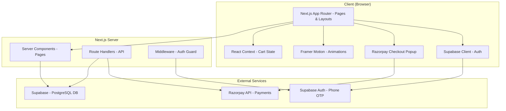
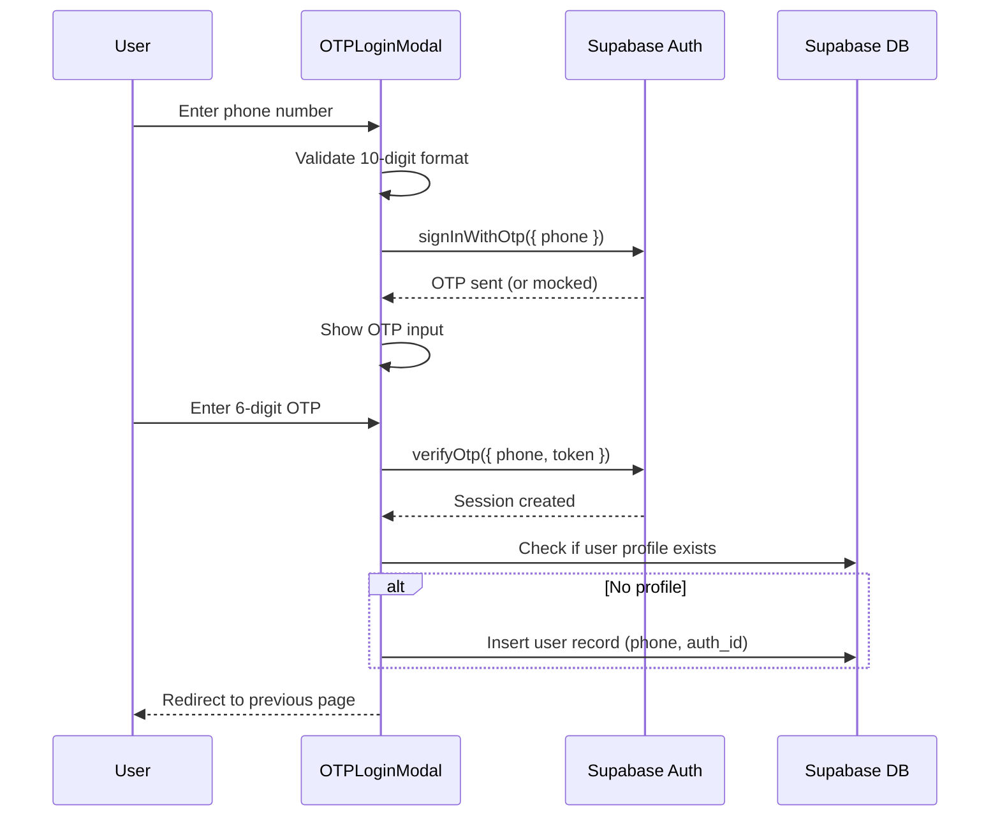
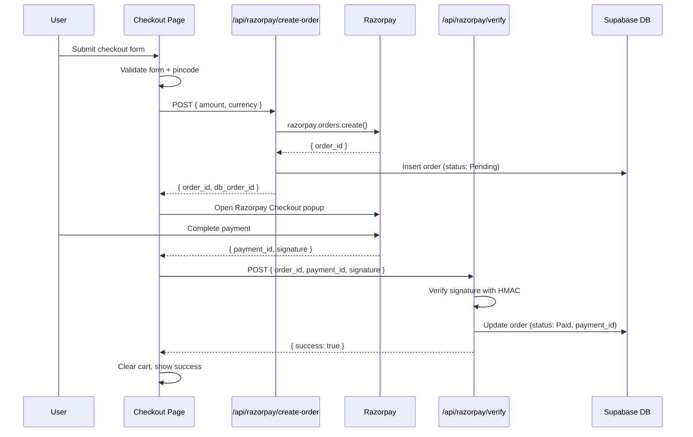
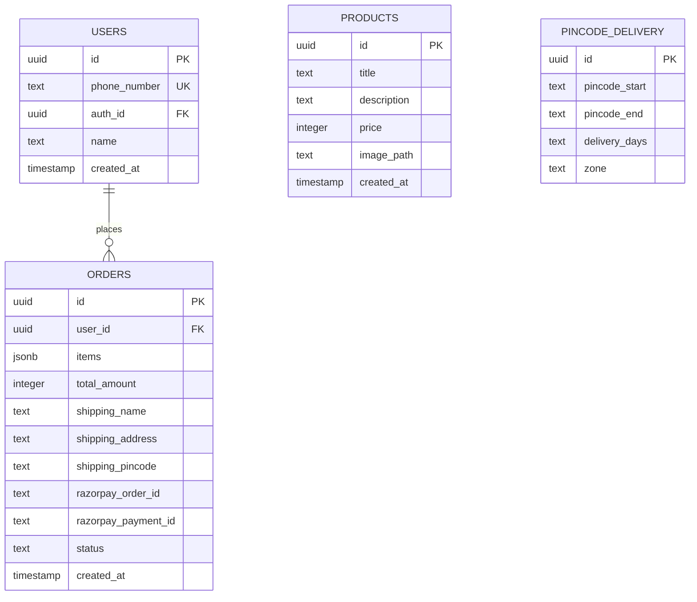

# Design Document: Spiritual Bookstore

## Overview

The Spiritual Bookstore is a full-stack ecommerce application built with Next.js 14+ (App Router), Supabase, Razorpay, Tailwind CSS, Shadcn/UI, and Framer Motion. The architecture follows a server-component-first approach with client components used only where interactivity is needed (cart, auth, animations). Supabase provides both the PostgreSQL database and phone OTP authentication. Razorpay handles payments in Test Mode via a client-side checkout popup backed by a server-side order creation API.

Key design decisions:
- **Server Components by default**: Pages and data-fetching components are React Server Components for performance.
- **Client Components for interactivity**: Cart state, auth modals, Framer Motion animations, and Razorpay checkout are client components.
- **Mock OTP in development**: The Auth_System accepts any 6-digit code locally, bypassing SMS costs.
- **Cart as client-side state**: Cart is managed via React Context + localStorage for simplicity (no cart table needed in DB until user checks out).
- **API Routes for sensitive operations**: Razorpay order creation and payment verification happen in Next.js Route Handlers to keep secrets server-side.

## Architecture



### Page Structure

```
app/
├── layout.tsx              # Root layout: fonts, theme, providers
├── page.tsx                # Home page (Server Component)
├── books/
│   └── [id]/
│       └── page.tsx        # Book detail page (Server Component + Client islands)
├── cart/
│   └── page.tsx            # Cart page (Client Component)
├── checkout/
│   └── page.tsx            # Checkout page (Client Component, auth-guarded)
├── orders/
│   └── page.tsx            # My Orders page (Server Component, auth-guarded)
├── auth/
│   └── login/
│       └── page.tsx        # Login page (Client Component)
├── api/
│   ├── razorpay/
│   │   ├── create-order/
│   │   │   └── route.ts    # Create Razorpay order
│   │   └── verify/
│   │       └── route.ts    # Verify payment signature
│   └── pincode/
│       └── route.ts        # Pincode delivery lookup
```

## Components and Interfaces

### Shared Components

| Component | Type | Description |
|-----------|------|-------------|
| `Navbar` | Client | Navigation bar with logo, cart icon with count badge, and login/profile button |
| `Footer` | Server | Simple footer with site info |
| `BookCard` | Client | Animated book card with image, title, price, and hover effects |
| `CartProvider` | Client | React Context provider managing cart state and localStorage sync |
| `AuthProvider` | Client | Wrapper providing Supabase auth session to the component tree |
| `PageTransition` | Client | Framer Motion wrapper for fade-in page transitions |
| `PincodeChecker` | Client | Input + button component that calls the pincode API and displays delivery estimate |
| `OTPLoginModal` | Client | Two-step modal: phone input → OTP input, using Supabase Auth |

### Key Interfaces (TypeScript)

```typescript
// Book / Product
interface Book {
  id: string;
  title: string;
  description: string;
  price: number;
  image_path: string;
  created_at: string;
}

// Cart Item
interface CartItem {
  book: Book;
  quantity: number;
}

// Cart Context
interface CartContextType {
  items: CartItem[];
  addItem: (book: Book) => void;
  removeItem: (bookId: string) => void;
  updateQuantity: (bookId: string, quantity: number) => void;
  clearCart: () => void;
  totalAmount: number;
  totalItems: number;
}

// Order
interface Order {
  id: string;
  user_id: string;
  items: OrderItem[];
  total_amount: number;
  shipping_name: string;
  shipping_address: string;
  shipping_pincode: string;
  razorpay_order_id: string;
  razorpay_payment_id: string | null;
  status: 'Pending' | 'Paid' | 'Shipped';
  created_at: string;
}

interface OrderItem {
  book_id: string;
  title: string;
  price: number;
  quantity: number;
}

// Pincode Delivery
interface PincodeDelivery {
  pincode_start: string;
  pincode_end: string;
  delivery_days: string; // "3 days" or "5-7 days"
  zone: 'fast' | 'standard';
}

// Checkout Form
interface CheckoutFormData {
  name: string;
  address: string;
  pincode: string;
}

// Razorpay Order (server-side creation response)
interface RazorpayOrder {
  id: string;
  amount: number;
  currency: string;
  status: string;
}
```

### Cart State Management

The cart uses React Context with localStorage persistence:

```typescript
// CartProvider logic (simplified)
function cartReducer(state: CartItem[], action: CartAction): CartItem[] {
  switch (action.type) {
    case 'ADD_ITEM': {
      const existing = state.find(item => item.book.id === action.book.id);
      if (existing) {
        return state.map(item =>
          item.book.id === action.book.id
            ? { ...item, quantity: item.quantity + 1 }
            : item
        );
      }
      return [...state, { book: action.book, quantity: 1 }];
    }
    case 'REMOVE_ITEM':
      return state.filter(item => item.book.id !== action.bookId);
    case 'UPDATE_QUANTITY':
      return action.quantity <= 0
        ? state.filter(item => item.book.id !== action.bookId)
        : state.map(item =>
            item.book.id === action.bookId
              ? { ...item, quantity: action.quantity }
              : item
          );
    case 'CLEAR':
      return [];
    default:
      return state;
  }
}
```

### Authentication Flow



In development mode, the OTP verification is mocked: the app intercepts the verify call and accepts any 6-digit code, creating a mock session.

### Razorpay Payment Flow



### Pincode Checker Logic

The Pincode_Checker works by querying a `pincode_delivery` table in Supabase that maps pincode ranges to delivery estimates:

```typescript
// /api/pincode/route.ts (simplified)
async function checkPincode(pincode: string): Promise<string> {
  // Validate 6-digit format
  if (!/^\d{6}$/.test(pincode)) {
    throw new Error('Invalid pincode format');
  }

  const { data } = await supabase
    .from('pincode_delivery')
    .select('delivery_days, zone')
    .lte('pincode_start', pincode)
    .gte('pincode_end', pincode)
    .single();

  if (!data) {
    return 'Delivery not available for this pincode';
  }

  return data.zone === 'fast'
    ? 'Delivered in 3 days'
    : 'Delivered in 5-7 days';
}
```

## Data Models

### Supabase Database Schema



### SQL Migration

```sql
-- Users table (linked to Supabase Auth)
CREATE TABLE users (
  id UUID PRIMARY KEY DEFAULT gen_random_uuid(),
  phone_number TEXT UNIQUE NOT NULL,
  auth_id UUID UNIQUE REFERENCES auth.users(id),
  name TEXT,
  created_at TIMESTAMPTZ DEFAULT now()
);

-- Products table
CREATE TABLE products (
  id UUID PRIMARY KEY DEFAULT gen_random_uuid(),
  title TEXT NOT NULL,
  description TEXT NOT NULL,
  price INTEGER NOT NULL, -- price in paise (smallest currency unit)
  image_path TEXT NOT NULL,
  created_at TIMESTAMPTZ DEFAULT now()
);

-- Orders table
CREATE TABLE orders (
  id UUID PRIMARY KEY DEFAULT gen_random_uuid(),
  user_id UUID NOT NULL REFERENCES users(id),
  items JSONB NOT NULL,
  total_amount INTEGER NOT NULL,
  shipping_name TEXT NOT NULL,
  shipping_address TEXT NOT NULL,
  shipping_pincode TEXT NOT NULL,
  razorpay_order_id TEXT,
  razorpay_payment_id TEXT,
  status TEXT NOT NULL DEFAULT 'Pending' CHECK (status IN ('Pending', 'Paid', 'Shipped')),
  created_at TIMESTAMPTZ DEFAULT now()
);

-- Pincode delivery mapping
CREATE TABLE pincode_delivery (
  id UUID PRIMARY KEY DEFAULT gen_random_uuid(),
  pincode_start TEXT NOT NULL,
  pincode_end TEXT NOT NULL,
  delivery_days TEXT NOT NULL,
  zone TEXT NOT NULL CHECK (zone IN ('fast', 'standard'))
);

-- Seed products
INSERT INTO products (title, description, price, image_path) VALUES
(
  'How to Find Guru',
  'There are five essays: How to Find Guru – by Srila Bhaktisiddhanta Saraswati; Krishna will give you Guru – by Srila Prabhupada; How to Find a Sadhu, A Sadhu is Always Present, and Simplicity and Faith – by Srila Gour Govinda Swami.',
  29900, -- ₹299.00
  '/images/guru-find.jpg'
),
(
  'Guru Tattva',
  'After many of his Godbrothers fell from their positions as sannyāsīs and gurus, Śrīla Gour Govinda Mahārāja presented this paper to the GBC members in 1989 for the sole purpose of establishing the absolute conception of (sad-) guru and to console Śrīla Prabhupāda''s grand-disciples.',
  34900, -- ₹349.00
  '/images/guru-tattva.jpg'
);

-- Seed pincode delivery data
INSERT INTO pincode_delivery (pincode_start, pincode_end, delivery_days, zone) VALUES
('110001', '110099', '3 days', 'fast'),
('400001', '400099', '3 days', 'fast'),
('560001', '560099', '3 days', 'fast'),
('700001', '700099', '3 days', 'fast'),
('600001', '600099', '5-7 days', 'standard'),
('500001', '500099', '5-7 days', 'standard'),
('302001', '302099', '5-7 days', 'standard'),
('380001', '380099', '5-7 days', 'standard');

-- Row Level Security
ALTER TABLE users ENABLE ROW LEVEL SECURITY;
ALTER TABLE orders ENABLE ROW LEVEL SECURITY;
ALTER TABLE products ENABLE ROW LEVEL SECURITY;
ALTER TABLE pincode_delivery ENABLE ROW LEVEL SECURITY;

-- Products and pincode_delivery are publicly readable
CREATE POLICY "Products are viewable by everyone" ON products FOR SELECT USING (true);
CREATE POLICY "Pincode delivery is viewable by everyone" ON pincode_delivery FOR SELECT USING (true);

-- Users can only read their own profile
CREATE POLICY "Users can view own profile" ON users FOR SELECT USING (auth.uid() = auth_id);
CREATE POLICY "Users can insert own profile" ON users FOR INSERT WITH CHECK (auth.uid() = auth_id);

-- Orders: users can only see their own orders; server can insert
CREATE POLICY "Users can view own orders" ON orders FOR SELECT USING (
  user_id IN (SELECT id FROM users WHERE auth_id = auth.uid())
);
CREATE POLICY "Service role can insert orders" ON orders FOR INSERT WITH CHECK (true);
CREATE POLICY "Service role can update orders" ON orders FOR UPDATE USING (true);
```

### Environment Variables

```
NEXT_PUBLIC_SUPABASE_URL=<supabase-project-url>
NEXT_PUBLIC_SUPABASE_ANON_KEY=<supabase-anon-key>
SUPABASE_SERVICE_ROLE_KEY=<supabase-service-role-key>
NEXT_PUBLIC_RAZORPAY_KEY_ID=<razorpay-test-key-id>
RAZORPAY_KEY_SECRET=<razorpay-test-key-secret>
NEXT_PUBLIC_MOCK_OTP=true
```


## Correctness Properties

*A property is a characteristic or behavior that should hold true across all valid executions of a system — essentially, a formal statement about what the system should do. Properties serve as the bridge between human-readable specifications and machine-verifiable correctness guarantees.*

The following properties were derived from the acceptance criteria in the requirements document. Each property is universally quantified and suitable for property-based testing.

### Property 1: Home page displays all catalog products

*For any* set of products in the Product_Catalog, the Home_Page featured books section should render exactly as many book cards as there are products in the database, and each product should appear exactly once.

**Validates: Requirements 1.2**

### Property 2: Phone number validation rejects invalid inputs

*For any* string that is not composed of exactly 10 decimal digits, the phone number validator should reject it and return a validation error. Conversely, for any string of exactly 10 digits, the validator should accept it.

**Validates: Requirements 2.7**

### Property 3: Auto-create user profile on first authentication

*For any* phone number that completes OTP verification and does not have an existing user profile, the Auth_System should create exactly one new user record in the Users table linked to that phone number and Supabase Auth ID.

**Validates: Requirements 2.4**

### Property 4: Book detail page displays all required fields

*For any* book in the Product_Catalog, the Book_Detail_Page should render the book title, description, image, price, "Buy Now" button, and "Add to Cart" button. All six elements must be present.

**Validates: Requirements 3.2**

### Property 5: Pincode checker returns correct delivery estimate

*For any* valid 6-digit pincode, if the pincode falls within a fast-delivery zone range in the pincode_delivery table, the Pincode_Checker should return "Delivered in 3 days". If it falls within a standard-delivery zone range, it should return "Delivered in 5-7 days". If it does not match any range, it should return "Delivery not available for this pincode".

**Validates: Requirements 4.2, 4.3, 4.4**

### Property 6: Pincode validation rejects invalid formats

*For any* string that is not composed of exactly 6 decimal digits, the pincode validator should reject it and return a validation error. Conversely, for any string of exactly 6 digits, the validator should accept the format.

**Validates: Requirements 4.5**

### Property 7: Cart operations maintain correct total (Invariant)

*For any* sequence of cart operations (add item, update quantity, remove item) applied to an initially empty cart, the `totalAmount` should always equal the sum of `(item.book.price × item.quantity)` for all items in the cart, and `totalItems` should always equal the sum of all item quantities.

**Validates: Requirements 5.1, 5.2, 5.3**

### Property 8: Cart persistence round trip

*For any* valid cart state (list of CartItems), serializing the cart to JSON for localStorage and then deserializing it back should produce an equivalent cart state with the same items, quantities, and computed totals.

**Validates: Requirements 5.5**

### Property 9: Successful payment creates a Paid order

*For any* valid checkout submission where the Razorpay_Gateway returns a successful payment response, the system should create exactly one Order record in the database with status "Paid", the correct total amount, and the Razorpay payment ID. The cart should be empty after the operation.

**Validates: Requirements 6.3**

### Property 10: Failed payment retains cart contents

*For any* checkout submission where the Razorpay_Gateway returns a failed payment response, the cart contents should remain identical to the state before the payment attempt. No Order with status "Paid" should be created.

**Validates: Requirements 6.4**

### Property 11: Checkout form validation catches invalid inputs

*For any* checkout form submission where at least one of Name, Address, or Pincode is empty or invalid, the validation should reject the submission and return errors for each invalid field. Payment should not be initiated.

**Validates: Requirements 6.5**

### Property 12: Orders page displays all user orders with required fields

*For any* authenticated user with N orders in the database, the My_Orders_Page should display exactly N orders, and each order should show the order date, items purchased, total amount, and current status.

**Validates: Requirements 7.1, 7.2**

### Property 13: Order status constraint

*For any* Order record, the status field should be one of exactly three values: "Pending", "Paid", or "Shipped". No other value should be accepted.

**Validates: Requirements 7.3**

## Error Handling

### Authentication Errors

| Error Scenario | Handling |
|---|---|
| Invalid phone number format | Display inline validation error, prevent OTP dispatch |
| Invalid OTP code | Display error message "Incorrect OTP, please try again", allow retry |
| OTP expired | Display error message "OTP has expired, please request a new one" |
| Supabase Auth service unavailable | Display generic error "Authentication service is temporarily unavailable" |
| User profile creation fails | Log error, retry once, display error if retry fails |

### Payment Errors

| Error Scenario | Handling |
|---|---|
| Razorpay order creation fails | Display error "Unable to initiate payment, please try again", retain cart |
| Payment popup closed by user | Display message "Payment was cancelled", retain cart |
| Payment verification fails (invalid signature) | Log security event, display error "Payment verification failed", do not create order |
| Razorpay service unavailable | Display error "Payment service is temporarily unavailable" |

### Data Errors

| Error Scenario | Handling |
|---|---|
| Product not found (invalid book ID) | Display 404 page |
| Pincode lookup fails (DB error) | Display "Unable to check delivery, please try again" |
| Order fetch fails | Display "Unable to load orders, please try again" with retry button |
| Cart localStorage corrupted | Reset cart to empty state, log warning |

### Network Errors

All API calls use try/catch with user-friendly error messages. No raw error details are exposed to the client. Server-side errors are logged for debugging.

## Testing Strategy

### Testing Framework

- **Unit & Integration Tests**: Vitest (fast, ESM-native, works well with Next.js)
- **Property-Based Tests**: fast-check (JavaScript/TypeScript PBT library)
- **Component Tests**: React Testing Library with Vitest
- **E2E Tests**: Not in scope for initial implementation (can be added later with Playwright)

### Dual Testing Approach

**Unit Tests** focus on:
- Specific examples demonstrating correct behavior (e.g., adding a specific book to cart)
- Edge cases (e.g., empty cart, zero quantity, corrupted localStorage)
- Integration points (e.g., Razorpay API route handler with mocked Razorpay SDK)
- Error conditions (e.g., invalid OTP, failed payment)

**Property-Based Tests** focus on:
- Universal properties that hold for all valid inputs
- Each property test runs a minimum of 100 iterations
- Each test is tagged with a comment referencing the design property:
  `// Feature: spiritual-bookstore, Property N: <property title>`

### Test Organization

```
__tests__/
├── unit/
│   ├── cart-reducer.test.ts        # Cart state logic
│   ├── validators.test.ts          # Phone, pincode, checkout form validation
│   ├── pincode-checker.test.ts     # Pincode lookup logic
│   └── order-status.test.ts        # Order status constraints
├── property/
│   ├── cart.property.test.ts       # Properties 7, 8
│   ├── validators.property.test.ts # Properties 2, 6, 11
│   ├── pincode.property.test.ts    # Property 5
│   └── order.property.test.ts      # Property 13
└── integration/
    ├── auth-flow.test.ts           # Auth flow with mocked Supabase
    ├── razorpay-api.test.ts        # Payment API routes
    └── orders-page.test.ts         # Orders page data fetching
```

### Property-Based Test Configuration

Each property test uses fast-check with:
- `fc.assert(fc.property(...), { numRuns: 100 })` minimum
- Custom arbitraries for domain types (Book, CartItem, Pincode, PhoneNumber)
- Tagged with design property reference

### Key Test Priorities

1. **Cart reducer** (Properties 7, 8) — Core business logic, pure functions, ideal for PBT
2. **Validators** (Properties 2, 6, 11) — Input validation, pure functions, ideal for PBT
3. **Pincode checker** (Property 5) — Lookup logic with clear input/output mapping
4. **Payment flow** (Properties 9, 10) — Critical path, tested with mocked Razorpay
5. **Order display** (Properties 12, 13) — Data integrity and display completeness
